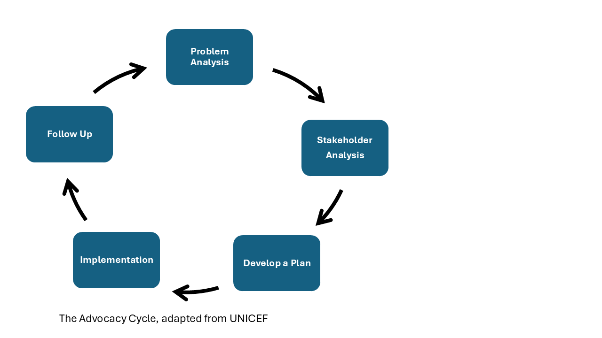

# Advocacy for Sustainable Research

!!! Learning Outcomes "Learning Outcomes from the Course"

	- Improved awareness of the power of advocacy, including the notion that it can take many forms, and be effective on multiple scales (small and large).
	- Understanding of the main steps in the process of advocacy
	- Awareness and confidence to use key tools to help design and create change (e.g. theory of change, identifying goals, strategies and actions).
	- Concrete steps to implement a plan. 

This course is designed to give people working in research institutions the knowledge and skills to help them advocate for environmental sustainability within their organisations.

It focuses on addressing the contribution digital research makes to the dual challenges of the climate crisis and biodiversity loss.  It teaches you how to translate concern about the environmental impact of digital research into effective, purposeful action within your organisation.

<!-- type: concept -->

- The course is heavily based on Greg Wilson's course on [Organisational Change](https://gvwilson.github.io/change/)

- It  focuses on advocacy for environmental sustainability within a digital research context. 

- It is designed to allow you design your own advocacy plan

<!-- end: type -->

# Introduction to Advocacy and Organisational Change

!!! Learning Outcomes

	- Understand what advocacy is and isn't
	- Know the different types of advocacy and how they relate
	- Understand how advocacy and organisational change connect

<!-- type: concept -->

## What is Advocacy?

There is no single definition of advocacy

	"Advocacy: public support for an idea, plan, or way of doing something" 
	– Cambridge dictionary

	"Advocacy is the set of activities by individuals or groups intended to influence decisions within political, economic, and social institutions." 
	– Wikipedia

<!-- end: type -->

<!-- type: quote -->

!!! quote

	"Advocacy is a process. It requires patience, strategy, and commitment."
	— [UNICEF](https://www.unicef.org/lesotho/media/1231/file/YPH-Module-4.pdf)

<!-- end: type -->

<!-- type: concept -->

## Types of Advocacy 

There are many different types of advocacy; e.g. personal advocacy (which is essentially speaking up for needs and rights) or legal advocacy (which involves using formal legal processes and rights-based action to challenge unfair treatment or enforce compliance with the law). 

- **Systems advocacy** = broad change across society, laws, or multiple organisations 

- **Institutional advocacy** = subset of systems advocacy, targeted change within a specific organisation or institution

<!-- slide break -->

Systems advocacy can drive much deeper, more lasting change than individual actions alone

Here we are focusing on institutional advocacy, which is where individuals or groups seek to influence organisations and systems so that policies, procedures, and practices are improved. 

<!-- end: type -->

<!-- type: concept -->

## What advocacy isn't

- Advocacy is not just complaining or expressing frustration without a clear aim 
- It is not a one-off opinion, but a purposeful attempt to influence change 
- It is not simply giving information without trying to affect decisions or practice 
- It is not always formal, and not always big. 

<!-- end: type -->

## Advocacy vs Activism

- Advocacy focuses on influencing decisions, policies, or systems, often through dialogue and structured engagement 
- Activism is usually more public-facing and protest-based, aiming to raise awareness and apply pressure for change (e.g. demonstrations, strikes, campaigns)

<!-- type: exercise -->

!!! question 

    Discussion: Can you think of any examples of external systems advocacy?
    An example of where somone outside of the system has created change.  

<!-- end: type -->

!!! Example "Systemic Advocacy driven from someone external to the organisation."

	In parts of Scotland, younger children who have Friday afternoons off school are given a packed lunch by the council — including a plastic bottle of water — even if they don't need one. Most bottles went home unopened, creating unnecessary plastic waste.

	A local mum petitioned to make the water bottle opt-in rather than automatic. A small change, but it saved money and cut waste. ([See article](https://www.edinburghlive.co.uk/news/edinburgh-news/east-lothian-mum-says-trip-22180718))

<!-- type: concept -->

## Introduction to organisational change 

The process of organisations changing their policies, practices, culture, or systems 

In environmental sustainability, this often means reducing environmental impact and improving resource efficiency. 

<!-- slide break -->

It may involve changes to: 

- Environmental policies (e.g. waste, energy, procurement) 
- Operational practices (e.g. recycling, transport, resource use) 
- Organisational culture (e.g. sustainability values, training and behaviours) 
- Systems and infrastructure (e.g. energy systems, supply chains) 

<!-- slide break -->

Organisational change is often driven by external pressures such as regulation, public expectation but can also be driven by advocacy from within the organisation.

<!-- end: type -->

## How advocacy and organisational change link together

Advocacy and organisational change are closely connected. Advocacy is the process — the deliberate effort to influence decisions. Organisational change is the outcome — the shift in policy, practice, or culture that results. One without the other is incomplete: advocacy that never lands produces no change, and change without advocates to sustain it often fades.

!!! tip

    One important thing to bear in mind: we usually see the result of change, not the process behind it. A new policy appears, a practice shifts — but the months of relationship-building, failed attempts, and strategic manoeuvring that made it happen are invisible. This means we often underestimate how much effort change actually requires, and we miss the chance to learn from the process. This course tries to make that process visible.

<!-- type: concept -->

## Scale — Big and Small Are Both Valid

- **Small-scale advocacy** focuses on a specific issue within a single organisation e.g. one policy, one practice, one routine
  - Faster to implement, easier to measure, less risky
- **Large-scale advocacy** aims to influence multiple organisations, sectors, or government policy
  - Deeper and can be more lasting, but slower and harder to initiate
- Both scales matter, and they are connected: small institutional wins build momentum for wider systems change

<!-- end: type -->

<!-- type: exercise -->

!!! question "Reflection"

	- Can you think of any examples of internal systems advocacy?   
	- What change resulted from it
	- What are the characteristics of the change that made is successful

<!-- end: type -->

<!-- type: framework-->

We often see the result of the change, not the process behind it. 

So we often don't have the chance to learn from the process. 

<!-- end: type -->

<!-- type: concept-->

## Advocacy cycle 
There are a number of different ways of structuring advocacy, in this course we have adapted the Advocacy Cycle from [UNICEF](https://www.unicef.org/lesotho/media/1231/file/YPH-Module-4.pdf) this will also form the structure of the rest of the course

<!-- end: type -->

<!-- type: concept-->

<!-- end: type -->

## The 5-Step Advocacy Cycle

**STEP ONE: Problem Analysis / Understanding the Issue** 
Research and gather evidence to better understand the problem. The more you know, the better equipped you are to act.

**STEP TWO: Stakeholder Analysis** 
Identify who is affected, who has the power to create change, and what influences their decisions. 

**STEP THREE: Develop a Plan** 
Create an advocacy plan covering: a problem statement, stakeholder analysis, target audiences, key messages, strategies and tactics (optional: a monitoring and evaluation framework).

**STEP FOUR: Implementation** 
Put the plan into action. Start by raising awareness, then build coalitions of support. Engage decision-makers through a mix of approaches

**STEP FIVE: Follow Up** 
Assess progress against objectives, hold decision-makers accountable to any commitments made, and maintain relationships with contacts built throughout the process for future collaboration.

This is likely to be an iterative process! 

<!-- type: concept -->
# Section 1 - Problem Analysis: Understand the Issue
<!-- end: type -->

!!! Learning Outcomes

	- Improved awareness and understanding of relevant environmental sustainability policies.
	- Familiarity with the concordat for environmentally sustainable research
	- Familiarity with relevant funders policies
	- Awareness of using policies to build an argument

<!-- type: quote-->

!!! quote

	"Describe how you will undertake your proposed research in an environmentally sustainable way." 
	– [Wellcome Funding Application Form](https://cms.wellcome.org/sites/default/files/2021-08/sample-full-app-form-wellcome-discovery-award.pdf)

<!-- end: type -->

There is background content on [The Need for Change](https://kirstypringle.github.io/teaching-for-impact/green-change/the-need-for-change/).

## Understanding the Issue: Environmental Policy

Step one of the advocacy cycle is to better understand the issue. As this course focuses on environmental sustainability within research organisations, there are some common concepts that will help us to understand the issue.

One big factor in environmental sustainability are high-level policies.

<!-- type: concept-->

## Concordat for the Environmental Sustainability of Research and Innovation Practice

The [Concordat for the Environmental Sustainability of Research and Innovation Practice](https://wellcome.org/about-us/positions-and-statements/environmental-sustainability-concordat) is a voluntary agreement, published in April 2024 and hosted by Wellcome, co-developed by over 25 organisations across the UK research and innovation sector. 

<!-- end: type -->

<!-- type: exercise -->

!!! question "Reflection"

    Have you heard of the concordat? Is your institution a signatory?

<!-- end: type -->

It represents a shared ambition for the UK to continue delivering cutting-edge research, but in a more environmentally responsible and sustainable way. 

Signatories agree to work individually and collectively to ensure the future design and practice of UK research and innovation is environmentally sustainable. 

Six priority areas

- Leadership and system change
- Sustainable infrastructure (buildings, digital infrastructure, labs, equipment)
- Sustainable procurement (circular economy principles, supply chains)
- Emissions from business and academic travel
- Collaborations and partnerships
- Environmental impact and reporting data

<!-- type: concept-->

What signing commits you to

- Publishing a letter from the head of organisation within 6 months
- Referencing the concordat in at least one prominent strategy or policy document
- Publishing an annual progress summary with priority actions for the year ahead
- Nominating a senior leader to sign off annual reporting

<!-- end: type -->

Signatories to the concordat commit to reporting annually on their website, covering:

- Total carbon emissions (scope 1 and 2) from direct operations
- Scope 3 emissions, with the most relevant categories being business travel, waste, supply chain, and investments
- Carbon offsets, if used
- Qualitative reporting is also expected, covering areas like biodiversity, water, waste, single use materials, and pollution.

Reporting should be proportionate to the size and maturity of the organisation, and should use existing frameworks where possible (for HEIs, this would be the HESA Estates Management Record and the HE Standardised Carbon Emissions Framework) rather than creating new bureaucracy.

!!! tip

	If your institution is a signatory, this annual report should exist and be publicly available on their website.

<!-- type: concept -->

The concordat is voluntary, but Wellcome requires organisations it funds in the UK to be signatories by the end of 2024, and Cancer Research UK similarly requires funded institutions to become signatories. **So, for many institutions, signing is effectively a funding condition.** 

<!-- end: type -->

<!-- type: concept -->

## UKRI Environmental Sustainability Strategy 2025–2030

UK Research and Innovation (UKRI) is the UK's main public funder of research and innovation.  
 and its environmental sustainability strategy sets expectations that ripple through to the institutions and researchers it funds.

<!-- end: type -->

<!-- type: quote -->
!!! quote

	"Our vision is to lead by example by embedding environmental sustainability across all aspects of research and innovation."
	– UKRI Environmental Sustainability Strategy (2025–2030)

<!-- end: type -->

<!-- type: concept -->

The [UKRI Environmental Sustainability Strategy 2025–2030](https://www.ukri.org/publications/ukri-environmental-sustainability-strategy/ukri-environmental-sustainability-strategy-2025-to-2030/) sets out UKRI's ambitions across six priority areas:

Organisational leadership, sustainable infrastructure, Supply chain and resource management, investments and collaborations, climate-conscious travel, environmental impact and reporting data.
<!-- end: type -->

- **Organisational leadership** – visible and credible commitment from senior leaders, environmental literacy training for all staff, and active sharing of good practice across the R&I sector
- **Sustainable infrastructure** – decarbonising UKRI-owned and operated facilities, transitioning to renewable energy, and ensuring facilities are climate-resilient
- **Supply chain and resource management** – embedding circular economy principles and sustainable procurement across UKRI's operations
- **Investments and collaborations** – integrating environmental sustainability into funding decisions and partnerships
- **Climate-conscious travel** – reducing emissions from business and academic travel, building on a 24% reduction already achieved against a 2017–18 baseline
- **Environmental impact and reporting data** – transparent, consistent measurement and public reporting of progress

!!! tip

	Notice that these six areas map closely onto the six priority areas of the Wellcome Concordat. UKRI was a co-developer of the Concordat and is now a signatory. When you see alignment between funder and sector-wide policy, that is a strong signal you can use in advocacy.

**What this means for institutions**

UKRI funds the vast majority of publicly funded research in the UK. When UKRI embeds sustainability expectations into its own operations and signals intent to integrate them into funding decisions, institutions have strong incentives to respond — whether or not they are directly required to.

The strategy explicitly frames environmental sustainability as a dimension of research culture, not just estates management. It calls for environmental literacy training, role modelling from senior leaders, and active sharing of good practice across the sector.

<!-- type: framework -->

**For advocates, policies matter because:**

- It gives you a high-authority external reference point when making the case internally
- It frames the issue as a professional and cultural norm, not just a compliance task
- It connects individual actions (e.g. a carbon impact statement in a grant application) to a sector-wide direction of travel

<!-- end: type -->

<!-- type: concept -->

## Institutional Environmental Sustainability Policy

High-level policies like the Concordat and the UKRI strategy matter — but for day-to-day advocacy within your organisation, **your institution's own environmental sustainability policy is often the most powerful tool you have**.

<!-- end: type -->

This is because it represents a public commitment made by your institution's leadership. When you can show that a proposed change is consistent with — or required by — your institution's own stated policy, you are no longer asking decision-makers to do something new. You are asking them to follow through on something they have already agreed to.

Most UK research institutions will have some form of environmental sustainability strategy or policy. Quality and ambition vary considerably. When reading yours, look for:

<!-- type: concept -->

**What to look for in your institution's policy**

- **Scope** — does it cover research practice or mainly buildings and operations?
- **Specificity** — are commitments time-bound and measurable? Watch for language like *"aim to explore"*, *"consider opportunities to"*, or *"where possible"* 
- **Accountability** — who is named as responsible? Is there a governance structure? A named senior lead?
- **Reporting** — is there publicly available data on progress? 
- **Gaps** — is there a mismatch between the policy and what you observe in practice?

<!-- slide break -->

!!! tip

	**A gap is a lever.** If your institution has committed to something publicly and is not yet delivering on it, that is a legitimate and constructive starting point for advocacy. You are not criticising the institution — you are helping it meet its own goals.

<!-- end: type -->

<!-- type: exercise -->

!!! question "Activity – Find your institution's sustainability policy"

	- Find your institution's environmental sustainability strategy. Where did you find it — how easy was it to locate?

	- Does your institution publish regular environmental performance data?

	- Are there gaps between what the policy promises and what you observe in practice? How might you use a gap as a lever for advocacy?

<!-- end: type -->

<!-- type: concept -->
# Section 2 - People, Power and Stakeholders
<!-- end: type -->

!!! Learning Outcomes

	- Understand how power operates in research institutions, and why it matters for advocacy
	- Be able to identify key stakeholders and map their formal and informal influence
	- Know how to use stakeholder analysis to decide who to target and how
	- Be able to create personas of key decision-makers to inform your advocacy strategy

<!-- type: concept -->

## Why People Are Central to Advocacy

No matter how strong your evidence or how clear your argument, change happens through people.

Understanding who those people are, what they care about, and how they relate to each other is as important as understanding the issue itself.

<!-- end: type -->

<!-- type: concept -->

## Power — What It Is and Who Has It

Formal power structures — org charts, job titles, committees — tell only part of the story.

Decisions are shaped by relationships, incentives, and informal influence as much as by official authority.

<!-- end: type -->

<!-- type: concept -->

One key thing about how institutional decisions get made: the person at the top doesn't need to satisfy everyone. They need to satisfy a much smaller group - the people whose support keeps them in their role. Finding out who that is tells you where to focus."

<!-- end: type -->

## Selectorate Theory

!!! tip
    Selectorate theory was developed to explain how political leaders gain and maintain power. While research organisations are not political systems, the theory provides a useful lens for thinking about organisational influence: in practice, leaders depend more on the support of some people than others. The concepts below are adapted in that spirit.

Research organisations are not democracies — leaders are not elected by the people they lead.

Selectorate theory helps explain how power actually works:

- **Nominal selectorate** — those who formally have a say
- **Real selectorate** — those whose views genuinely count
- **Winning coalition** — the small group whose support is essential to stay in power

<!-- end: type -->

Take a university as an example. Staff, students, governors, funders, and 
the wider public are all part of the nominal selectorate — they formally 
have a say. But the real selectorate is smaller: the people whose views 
the Vice-Chancellor actually needs to weigh. And the winning coalition 
smaller still — perhaps the senior leadership team, key heads of 
department, and major funders. A proposal that those people support will 
move forward; one that threatens their interests will stall, regardless 
of how well-evidenced it is or how many people want it.

For advocates, this is clarifying. You do not need to convince everyone — 
you need to understand who is actually in the winning coalition for the 
specific change you are seeking, and focus your energy there.

<!-- type: concept -->

## What This Means for Advocates

- Decision-makers primarily need to satisfy their winning coalition, not everyone
- Find out who is in that coalition — these are the people worth influencing
- A proposal that threatens the winning coalition will be resisted, regardless of its merits

!!! tip

	You don’t need to convince everyone. You need to convince the right people.

## Exercise: Who’s in Charge?

1. Who formally makes funding and work allocation decisions in your institution?
2. Who do they actually need to keep happy — and how do they do that?

<!-- type: concept -->

## Power Mapping

A practical tool for visualising where power sits in relation to your cause.

- Who has formal authority to approve or block the change you want?
- Who influences those people, even without formal authority?
- Who are your potential allies, and who might resist?

<!-- end: type -->

!!! tip
    The Museum of Protest's guide on [Power Analysis and Stakeholder Mapping](https://museumofprotest.org/guides/guide-power-analysis-and-stakeholder-mapping/) 
    goes deeper on these concepts, with practical methods and real-world examples 
    drawn from campaigning and community organising. 

<!-- type: concept -->

## Stakeholder Analysis

Once you know where power sits, categorise the people involved:

- **Allies** — broadly supportive; potential collaborators
- **Opponents** — likely to resist or actively work against change
- **Neutrals** — not yet engaged; could move in either direction

The goal is not just to identify who is who, but to understand *why* — what are their interests, incentives, and constraints?

<!-- end: type -->

<!-- type: example -->

## Worked Example: Greendale University

Greendale is a fictional mid-sized research-intensive UK university. A group of researchers and RSEs want to advocate for a policy requiring all research computing to be reported as part of the university’s carbon footprint.

A group of researchers and RSEs want to advocate for a policy requiring all research computing to be reported as part of the university's carbon footprint.

<!-- slide break -->
<!-- small -->

- **Prof. Sarah Okafor** — Vice-Chancellor. Very high formal power. Low interest — focused on rankings and income.
- **Dr. James Whitfield** — Head of Research Computing. High formal power. Medium interest — cautious about extra workload.
- **Dr. Priya Nair** — Sustainability Manager. Very high interest. Low formal power — advisory only.
- **Prof. Duncan Laird** — Dean of Research. High formal power. Supportive but risk-averse.
- **Ravi Okonkwo** — RSE, community organiser. Very high interest. Low formal power but high informal influence.
- **Dr. Hannah Frost** — Head of Finance. Medium formal power. Low interest — can quietly block or enable.

**Understanding the landscape**

- Who has the most power here — formal or informal?
- Who would you approach first, and why?
- Who might block this, and how would you get ahead of it?
- What is Ravi’s role, given he has no formal authority?

<!-- end: type -->

<!-- type: reflection -->

The goal of power mapping isn't to find the one person you need to convince. It's to understand the ecosystem well enough that you can move through it strategically to build support and remove blockers so you can arrive at decision-makers with momentum rather than a cold ask.

<!-- end: type -->

<!-- type: reflection -->

### A Note on Discomfort

In this course we use fictional examples for power mapping. Many people find power mapping uncomfortable, particularly if their map includes people who are also in the room.

This discomfort is one of the reasons things don't get better: thinking consciously about how to change people's minds makes compassionate people squeamish.

But if we don't do it, it will be done by people whom it *doesn't* make uncomfortable.

<!-- end: type -->

<!-- type: concept -->

## Personas of Key Power Players

If a power map helps to tell you who matters, a persona helps you to think about how to approach them.

<!-- slide break -->

A useful persona includes:

- **Role and context** — what do they do, and what pressures are they under?
- **What they care about** — their priorities and incentives
- **Their likely response** — ally, opponent, or neutral? What might shift them?
- **How to reach them** — what messages or relationships are most likely to be effective?

<!-- end: type -->

!!! tip

	Even a rough sketch based on role and public behaviour is better than treating someone as an abstraction. Writing the persona often reveals gaps in what you know — which is itself useful.

!!! question "Activity: Write a persona"

	Choose one person from the Greendale power map and write a short persona using the structure above.

	Consider: What would make them say yes? What would make them say no?

<!-- type: concept -->

## Stories and Personas

A persona tells you who someone is. That tells you which story to use.

- A **burning platform** story makes visible why the status quo is unsustainable — the risks and consequences of not acting. Creates urgency, but works best when paired with a vision of what change looks like.
- A **vision** story offers a compelling picture of where things could be heading. Connects the change to values people already hold — good science, fairness, responsibility, reputation. Particularly useful with senior leaders.
- A **springboard** story is a concrete example of successful change, close enough to your context that people can recognise themselves in it. Answers the unspoken question: *has anyone actually done this?*
- A **champion** story frames change as a collective journey — people navigating real challenges, learning, and making progress. Builds shared identity and community.

<!-- end: type -->

Once you have a persona, you can ask: what kind of story would land with this person? A finance director who fears cost and risk needs a springboard story — a concrete example of another institution that made this change and saved money. A Dean who cares about reputation needs a vision of what sector leadership looks like. A cautious peer needs to hear that someone like them tried this and it worked.

Stories also flow in both directions. Leadership narratives set direction and signal commitment. Bottom-up stories — your own direct experience of what is broken or what has worked — ground those priorities in lived reality. For advocates without formal authority, bottom-up stories are often the most accessible tool. The computing job that used more energy than you expected, the grant application that had nowhere to record sustainability commitments — framed well, these are evidence.

See [The Power of Stories](the-power-of-stories.md) for more on each type.

## Using Your Analysis to Decide Who to Target

<!-- type: concept -->

## Who to Target

- **Start with allies, not decision-makers** — arrive with support, not alone
- **Don’t neglect neutrals** — they are often more valuable to win over than opponents
- **Match your message to the person** — what “matters” means something different to a sustainability manager and a head of finance
- **Informal influence often matters more than formal authority** — a trusted peer can open doors a formal proposal cannot

<!-- end: type -->

!!! question "Activity: Targeting strategy"

	Using the Greendale power map and your personas:

	1. Who will you approach first, and why?
	2. What is your core message, and how will you adapt it for different people?
	3. Who might resist, and how will you respond?
	4. What does a realistic first step look like?

# Section 3 - Develop a Plan

!!! Learning Outcomes

	- Understand the relationship between cause, goal, strategy, and tactic
	- Be able to apply the framework to a real advocacy scenario
	- Recognise common pitfalls such as goal confusion and goal drift
	- Know how to choose between different approaches to advocacy
	- Be able to draft a theory of change and a basic advocacy plan
	- Understand why organisational change requires practical wisdom, not just rules

!!! tip

	Advocates have created great changes in the world — contributing to the end of segregation in the USA, votes for women, marriage equality, and much more. The [Museum of Protest](https://museumofprotest.org/guides/) is a fascinating resource with real examples and practical theory.

<!-- type: concept -->

Cause, Goal, Strategy, Tactic

**Cause** — the underlying reason why the goal matters
*e.g. Research contributes to climate change, and has a responsibility to change*

**Goal** — something you want to accomplish
*e.g. Make research practice more environmentally sustainable*

**Strategy** — a long-term plan to achieve that goal
*e.g. Embed environmental sustainability as a professional norm across research institutions*

**Tactic** — a specific action within the strategy
*e.g. Require a carbon impact statement in grant applications*
<!-- end: type -->

<!-- type: concept -->

## Navigating the Chain

		CAUSE

      └─— GOAL

        └─— STRATEGY

            └─— TACTIC

            └─— TACTIC

            └─— TACTIC

**Ask “why?” to move up — ask “how?” to move down**

<!-- end: type -->

<!-- type: concept -->

## Common Pitfalls

**Confusing tactics with goals**
- Signing the Concordat isn’t the goal: changing research practice is

**Goal drift** — goals quietly multiply over time, pulling in different directions, while everyone is heads-down on tactics

**Losing sight of the cause** makes it harder to recruit allies and sustain motivation

<!-- end: type -->

<!-- type: exercise -->

!!! question "Activity – Goals, strategies and tactics"

	Your university has decreed that all new grant applications must include a section estimating the carbon footprint of the proposed work. Applications without this section will be returned without review.

	- Identify the cause, goal, strategy, and tactic in the statement above
	- Identify at least three ways this proposal could go wrong

<!-- end: type -->

<!-- type: concept -->

## Understanding Your Contribution

As you develop your advocacy plan, reflect on what you personally can bring:

- Your skills and expertise
- Your available time and energy
- Your level of comfort with different activities (public speaking, writing, relationship-building)

These factors may shape your goals.

<!-- end: type -->

See: [Museum of Protest — Understanding Activism](https://museumofprotest.org/guides/guide-understanding-activism/)

<!-- type: concept -->

## Approaches to Advocacy

Three complementary approaches — use in combination:

- **Data-driven** — evidence, metrics, policy benchmarks
- **Storytelling** — lived experience, concrete examples
- **Policy engagement** — existing institutional and funder commitments

<!-- end: type -->

The three approaches work best in combination, and the right balance depends on your audience and what stage you are at.

**Data-driven advocacy** makes the case with evidence — emissions figures, energy use data, funder requirements, policy benchmarks. It works well when decision-makers need to see that a problem is real and measurable, or when you are trying to shift something from "nice to have" into the category of "we have a documented gap to close." Numbers establish that the problem exists. They rarely, on their own, make anyone care enough to act.

**Storytelling** connects the issue to lived experience. People may ask for numbers, but they are moved by stories. The story types introduced in Section 2 each serve different moments in an advocacy campaign: burning platform stories create the case for urgency, vision stories inspire, springboard stories overcome scepticism, and champion stories build community. 

Use the type that fits the moment and the person. Data establishes that the problem is real; stories make people want to do something about it.

**Policy engagement** is often the most powerful lever inside institutions, and the most underused. It means taking the commitments your institution has already made publicly — through its own sustainability strategy, through the Concordat, through funder requirements — and using them to frame your ask. This reframes the conversation entirely. You are no longer asking decision-makers to do something new. You are asking them to follow through on something they already signed up to. That is a much easier conversation.

<!-- type: framework -->

## Framing Your Message

The same proposal lands differently depending on who you are talking to.

Lead with what that person cares about:

- **Research leadership** — reputation, funder requirements, competitive positioning
- **Finance** — cost reduction, future regulatory risk, efficiency gains
- **Facilities / IT** — operational improvement, procurement criteria, sector leadership
- **Researchers** — time saved, reproducibility, grant eligibility
- **Students** — values alignment, employability, institutional integrity

<!-- end: type -->

Framing is all about recognising that people have different priorities and responsibilities, and that the same change means different things to different people. 

A common mistake advocates make is leading with the argument that convinced them. If you care deeply about climate change, that is what you will want to talk about. 

A useful test: before any significant conversation, ask yourself — *what problem does this solve for them?* Considering their role, with the pressures that they face. If you cannot answer that question, you are not ready for the conversation yet.

!!! tip

    People rarely oppose sustainability because they dislike sustainability. They resist because they fear workload, cost, risk, or compliance burden. 
    
    Where possible, consider how to address that fear.

<!-- type: exercise -->

!!! question "Activity – Frame your proposal"

    Take the advocacy goal you have been working with — from Greendale or your own institution.

    Write a two-sentence pitch for each of the following audiences:

    1. A senior research leader (Dean or VP Research)
    2. A head of IT or research computing
    3. A finance director

    Same proposal. Different frame. What changes — and what stays the same?

<!-- end: type -->

<!-- type: concept -->

## Putting Together Your Plan

A good advocacy plan doesn't need to be long, but it should be honest and down to earth.

- **The problem** — what specifically are you trying to change, and why now?
- **The goal** — what does success look like in concrete terms?
- **Stakeholders** — who needs to be persuaded? Who are your allies?
- **Strategy and tactics** — how will you make the case, and in what order?
- **Your contribution** — what can you realistically commit to?

<!-- end: type -->

Think of the plan as a working document — something you return to and revise as you learn more, not a prediction of the future. Its purpose is to make your thinking visible so you can test it against reality.

That last question — what can you realistically contribute — matters more than people usually admit. Advocacy sustained by one exhausted person is fragile. An honest look at your own capacity, and where you need others, is part of good planning.

<!-- type: framework -->

## Theory of Change

Makes explicit the connection between what you are doing and the change you want to see.

**If** we do X, **then** Y will happen, **because** Z

*Example: If we run workshops on measuring computing carbon footprints, then more researchers will include this in grant applications, because they will have the knowledge and a method to do so.*

<!-- end: type -->

Writing this out — even roughly — does several useful things. It forces you to name your assumptions. It shows you who you are depending on and where things could break down. And it makes it easier to spot when a tactic has drifted away from the goal it was supposed to serve.

!!! tip

    You do not need a formal document. One sentence — *if X, then Y, because Z* — is more useful than no theory at all. If you cannot write the sentence, that is usually a sign the plan needs more thinking before it needs more doing.

<!-- type: framework -->

## Top-Down or Bottom-Up?

There is no single right approach to institutional change. Research by Borrego & Henderson suggests two useful dimensions to consider:

- **Prescribed vs emergent** — are you pushing a specific solution from above, or nurturing change that grows from within?
- **Individuals vs systems** — are you trying to change how people think and act, or trying to change the structures and incentives around them?

Most successful campaigns combine elements of both. The question is where to start given your context, your relationships, and your resources.

<!-- end: type -->

<!-- type: concept -->

## The Right Kind of Knowledge

Organisational change requires a particular kind of knowledge that is hard to teach from a textbook.

- **Techne** — rule-based knowledge derived from principles: *"if X, then Y"*. Useful, but limited in complex human situations.
- **Metis** — practical wisdom built through experience: knowing how to read a room, adapt to what is actually happening, and navigate situations that are never quite the same twice.

Researchers and technical professionals are trained to value techne. Advocacy requires metis. The frameworks in this course are useful starting points — but they will not tell you exactly what to do in your specific institution, with your specific people, at this specific moment. That part you have to develop through doing.

<!-- end: type -->

<!-- type: exercise -->

!!! question "Activity – Draft your advocacy plan"

    Using the Greendale scenario or your own institution:

    1. Write a one-paragraph problem statement. What is the issue? Why does it matter now?
    2. State your goal in one sentence. Is it concrete and observable?
    3. List your top three stakeholders and their current position.
    4. Write your theory of change: *if we do X, then Y, because Z.*

<!-- end: type -->

---

<!-- type: concept -->

# Section 4 – Implement Your Plan

<!-- end: type -->

!!! Learning Outcomes

    - Know how to find a realistic and effective starting point for your advocacy
    - Understand how change spreads, and what that means for who you involve first
    - Be able to build a coalition and navigate institutional decision-making
    - Know how to handle resistance, setbacks, and advice to stop

<!-- type: concept -->

## Before You Start: Find Out What Has Been Tried

- You may not be the first person to attempt this
- An honest conversation with someone who tried before is worth hours of planning
- Find out: what was attempted, what happened, why it stalled, whether it was officially stopped

<!-- end: type -->

The temptation at the start of any advocacy effort is to get moving. Resist it, briefly.

Before you take any action, find out who has already tried to make this kind of change in your organisation — and what happened. This is not discouraging; it is essential intelligence. An honest conversation with someone who attempted something similar will tell you more than hours of planning: where the resistance came from, who the allies were, what stalled the change, and whether it was ever officially stopped or simply ran out of energy.

You may find that the groundwork has already been laid. You may find that a previous attempt failed for reasons that no longer apply. You may find that the person you are talking to is exactly the ally you need. None of that is visible until you ask.

<!-- type: framework -->

## How Change Spreads: Diffusion of Innovations

1. **Knowledge** — person becomes aware the change exists
2. **Persuasion** — they form an attitude toward it
3. **Decision** — they choose to adopt, ignore, or reject it
4. **Implementation** — they actually do it
5. **Confirmation** — the change becomes normal, or fades

<!-- end: type -->

Understanding this model helps you think about where different people are in relation to your idea — and what they need from you to move to the next stage.

Two things are worth holding onto. First, people can drop out at any stage — including after they have said yes, and even after they have started. Getting someone to agree is not the same as getting them to follow through. Second, most people are not at the extremes. They neither strongly support nor strongly oppose most proposals. They are waiting to see what happens, and they will be persuaded more by social proof and trust than by evidence alone.

<!-- type: concept -->

## What This Means in Practice

- People can drop out at any stage — including after saying yes
- Most people are neither strong supporters nor strong opponents — they are waiting
- Facts rarely persuade on their own — stories and trust do
- Many changes never get officially rejected — they just lose energy and fade

<!-- end: type -->

<!-- type: exercise -->

!!! question "Activity – Mapping a past change"

    Think of one recent attempt to change something in your organisation.

    1. Map it against the five diffusion stages. What happened at each one?
    2. Where did momentum stall, and why?
    3. Was the change ever officially halted, or did it just gradually stop happening?

<!-- end: type -->

<!-- type: concept -->

## Choosing Where to Start

Choose a starting point that gives you the best chance of early success:

- **Start small** — builds credibility, skills, and community with less risk
- **Pick something already widely supported** — look mainstream, not radical
- **Pick something immediately useful** — changes that help people stick
- **Use existing relationships** — *"we think"* is more persuasive than *"I think"*

<!-- end: type -->

The best starting point is rarely the most ambitious one — and that is not a compromise, it is strategy.

**Start with something small.** A small win builds your credibility, develops your skills, and creates a group of people who have done something together — which is itself a foundation for what comes next. It also limits the damage if things do not work out.

**Pick something already widely supported.** You want to appear to be part of a mainstream direction of travel, not a lone voice pushing against the current. Look for changes that align with what the institution already says it wants to do, with funder expectations, or with things colleagues regularly complain about but nobody has fixed.

**Pick something immediately useful.** The single biggest reason changes fail to stick is that they make things harder before they make things better, and people give up during the dip. A change that makes someone's working life a little easier — not just the organisation's carbon footprint — has a much better chance of becoming the new normal.

**Use the relationships you already have.** Arriving with even one or two colleagues who share the goal changes the dynamic entirely. Movements are built on pre-existing trust. *"We think"* carries more weight than *"I think"* — and groups usually come up with better ideas than individuals working alone.

<!-- type: exercise -->

!!! question "Activity – Choosing a starting point"

    1. Individually: list three changes in your institution that are small, supported, useful, and achievable.
    2. In a group: compare lists.
        - Which changes appeared on several people's lists?
        - What does it tell you if a change only appeared on one person's list?

<!-- end: type -->

<!-- type: exercise -->

!!! question "Activity – Being new"

    1. Why can it be harder to change an organisation you have just joined than one you have belonged to for a long time?
    2. Why is it sometimes easier to change an organisation you are new to?

<!-- end: type -->

<!-- type: framework -->

## Who to Involve First

**Start with:**

- **Connectors** — trusted across the organisation, help spread the word (expect reciprocity)
- **Gurus** — respected for expertise; their endorsement carries weight because they are selective

**Not yet:**

- **Innovators** — enthusiastic but less persuasive; known to champion many things
- **Decision owners** — approach once you have a coalition, not before

<!-- end: type -->

Not everyone is equally worth approaching at the start — and the people with the most formal power are usually not the right first call.

A **Connector** is someone who knows everyone across different parts of the organisation and is trusted by most of them. They are invaluable for spreading the word and building the coalition. They tend to operate on reciprocity — be ready to support their causes in return.

A **Guru** is someone widely respected for their expertise or judgement. If a Guru backs your idea, the message to others is clear: *if they think this is worth doing, it probably is.* Their endorsement carries weight precisely because they do not give it to everything.

An **Innovator** seems like a natural ally, but their backing is less persuasive than it looks. People know they champion many ideas, and that enthusiasm does not always last. Save the Innovators for later, when you need energy rather than credibility.

The **decision owners** — the people with formal authority to approve the change — should not be your first contact. Arrive with a coalition. There is a significant difference between turning up alone with an idea and turning up with a group of respected colleagues who already support it.

<!-- type: exercise -->

!!! question "Activity – Who's who in your institution?"

    1. Individually: name one Connector, one Guru, and one Innovator in your organisation.
    2. Share in a group.
        - Which names appeared on several lists?
        - What does it suggest about someone nobody listed in any category?

<!-- end: type -->

<!-- type: concept -->

## On Politics

Politics is not a dirty word.

- It is how groups make decisions when they do not agree on goals
- Explaining things again to people who disagree rarely changes their minds
- The goal is a **winning coalition** — enough of the right people, not everyone

<!-- end: type -->

If you are advocating for change inside an organisation, you will encounter politics. This is not a sign that something has gone wrong — it is a sign that you are trying to change something that matters to more than one person.

Politics simply means that the same evidence, the same data, and the same arguments can be interpreted very differently by people whose priorities differ. Explaining things again to someone who disagrees is rarely going to change their mind. What you need instead is a **winning coalition**: enough of the right people to get the change approved. The earlier work on power mapping and stakeholders was preparing you for exactly this moment.

<!-- type: concept -->

## Building Support and Closing the Deal

- Support other causes in exchange for support for yours
- Connect your proposal to something larger with existing momentum
- Bring in credible external voices — incidental endorsement carries weight
- Accept half a victory and build on it — a trial run is still a start
- Acknowledge the dip: any new way of working initially slows people down

<!-- end: type -->

There is no single script for getting a change over the line, but a few approaches tend to work.

**Support other causes in exchange for support for yours.** Coalition-building is inherently reciprocal. Backing someone else's proposal costs little and builds the kind of goodwill that is useful when you need something in return — as long as the goals do not conflict.

**Connect your proposal to something larger.** If your change can be framed as part of a broader initiative that already has institutional momentum — an existing strategy, a funder requirement, a sector-wide commitment — it is much harder to set aside. Be careful not to create extra work for people at a difficult time, though. Timing matters.

**Bring in credible external voices.** A respected outsider who supports your proposal changes the dynamic. Even better if sustainability is not the stated reason for their visit — endorsement that arrives incidentally often carries more weight than endorsement that looks arranged. 

When you bring in external voices, **one of the most persuasive thing they can offer is a story**. A colleague from another institution who shares how their team made a similar change (what they tried, what resistance they encountered, how they got it over the line) carries far more weight than a straightforward endorsement. 

Collect these accounts deliberately and use them strategically. A well-chosen springboard story, told by the right person at the right moment, can shift a room.

Stories also spread change beyond your immediate campaign. When people share what has worked they create the social proof that makes change feel possible elsewhere. Norms shift through accumulated stories of people doing things differently.

**Accept half a victory and build on it.** Two steps forward and one step back is still progress. A pilot, a trial period, or partial agreement can become the foundation for the next ask. If someone will not commit fully, ask for a trial run — most people who are reluctant to commit permanently are willing to try.

**Acknowledge the dip.** Any new way of working initially slows people down. Saying this upfront — *"we know the first few months will feel harder, and here is why it is worth staying with it"* — makes you more credible. People are more likely to stick with you through friction when they were told to expect it.

<!-- type: concept -->

## Changing Minds

- Debate rarely changes minds — people choose beliefs based on identity and trust
- **Trusted relationships** matter more than better arguments
- **Shared action** builds commitment and aligns belief with behaviour
- Change happens slowly, through accumulated small interactions

<!-- end: type -->

Debate rarely changes minds. People tend to choose beliefs based on their sense of identity and social belonging — not because they evaluated all the evidence and updated their views rationally. Presenting a better argument to someone who is resistant usually just makes them better at arguing back.

What actually shifts people is different. Trusted relationships matter more than correct arguments — a person you respect and feel warmly toward is far more persuasive than a stranger with a stronger case. Shared action matters too: participating in something together, even in a small way, increases commitment and brings beliefs into alignment with behaviour. And time matters — most genuine shifts happen slowly, through accumulated small interactions rather than a single decisive moment.

This is why building relationships — with allies, with neutrals, even with soft opponents — is not a distraction from the work. It is the work.

<!-- type: exercise -->

!!! question "Activity – Changing your mind"

    Describe something important that you have changed your mind about in the last ten years.

    - What shifted you? Was it evidence, a relationship, an experience, or something else?
    - What does this tell you about how to approach people you are trying to persuade?

<!-- end: type -->

<!-- type: framework -->

## Dealing with Resistance

- **Formalise the sceptic** — invite thoughtful critics in; often improves the proposal
- **Isolate committed opponents** — do not spend disproportionate energy on people who will never agree
- **Plan for maintenance** — sustaining a change takes more effort than launching it

<!-- end: type -->

Some resistance is productive. Inviting a thoughtful critic into the process — rather than treating them as an obstacle — often improves your proposal, and makes it harder for them to oppose it later. Where possible, formalise this: give the criticism a constructive outlet.

Some resistance will not shift, and spending disproportionate energy on committed opponents is rarely worth it. Know when to move forward without them.

The hardest resistance to navigate is inertia — the tendency for people to keep doing things the old way long after the organisation has nominally moved on. Plan for it. Getting a change approved is the beginning, not the end. Maintenance requires more effort than launch.

<!-- type: exercise -->

!!! question "Activity – Inertia"

    Describe a case where people continued doing things the old way after most of the organisation had moved to a new way of working.

    1. Why was this permitted?
    2. What were the benefits and drawbacks of allowing it?

<!-- end: type -->

<!-- type: reflection -->

## When People Tell You to Stop

- If one trusted person says stop — keep going
- If several say it — listen carefully
- Distinguish: disagreement on **goals** (fundamental) vs disagreement on **strategy** (navigable)

<!-- end: type -->

At some point, someone you respect will tell you this is not going to work.

If one person says this, keep going. If several people you trust say it, take it seriously — but distinguish carefully between two different kinds of disagreement. If they are more risk-averse than you, or if their values on this issue differ from yours, you can hear them out and continue. But if they are raising substantive concerns about your approach — the strategy, the timing, who you are targeting — that is worth sitting with.

Ask yourself whether the disagreement is about *what* you are trying to achieve or *how* you are trying to achieve it. The first is fundamental. The second is navigable.

<!-- type: exercise -->

!!! question "Activity – Retrospective on change"

    1. In small groups: discuss one change at your institution that ran out of steam. What went wrong? Was it officially stopped, or did it just fade?
    2. In small groups: discuss one change that succeeded. What did its advocates do to get it over the line that is not on any list?

<!-- end: type -->

---

<!-- type: concept -->

# Section 5 – Follow Up and Evaluate

<!-- end: type -->

!!! Learning Outcomes

    - Know how to assess whether your advocacy is working
    - Understand the difference between outputs, outcomes, and impact
    - Be able to hold decision-makers accountable to commitments they have made
    - Know how to sustain motivation and recognise when you need to step back

<!-- type: concept -->

## Why Evaluation Matters

Not just a reporting requirement — it is how you find out if your theory of change was right.

The key question is not: *did we do what we planned?*

It is: *did anything actually change as a result?*

<!-- end: type -->

Evaluation is easy to deprioritise when you are in the middle of doing the work. But catching a gap between what you expected and what is actually happening — early — gives you a chance to adjust. Discovering it only at the end means you have spent time and goodwill on something that was not working, without knowing why.

<!-- type: framework -->

## What to Evaluate

- **Outputs** — what you produced: workshops run, meetings held, documents submitted
- **Outcomes** — what changed: policies adopted, behaviours shifted, commitments made
- **Impact** — the broader change: emissions reduced, culture shifted, others influenced

Most early-stage advocacy can only track outputs and early outcomes — and that is fine. But be honest about the difference: counting attendees is not the same as measuring behaviour change.

<!-- end: type -->

It helps to set out what level you are working at before you start, not after. If you are at the outputs stage, say so. Claiming impact when you have only measured activity will undermine your credibility with the people you most need to convince next time.

<!-- type: concept -->

## Following Up on Commitments

If your advocacy resulted in a commitment — follow up. This is not aggressive. It is part of the process.

- Agree in advance what success looks like and how it will be measured
- Get a review point in diaries while goodwill is high
- Keep records — emails, meeting notes, public statements

Decision-makers are not always acting in bad faith when things slip. They are busy. Your role is to keep the commitment visible.

<!-- end: type -->

Maintaining relationships with the people you engaged — allies, neutrals who came with you, decision-makers who said yes — is part of this too. The network you built during the campaign is worth tending even when there is nothing immediately to ask for. Future advocacy is significantly easier when it builds on existing trust rather than starting from scratch every time.

!!! tip

    As you follow up and maintain relationships, gather stories deliberately — accounts of what changed, how it happened, and what made the difference. These become the springboard stories for your next round of advocacy, and for others working on similar changes elsewhere. The most useful thing you can share with the wider community is not just *what* you achieved, but *how* — the specific people, the specific moments, the specific framing that moved things forward.

<!-- type: exercise -->

!!! question "Activity – Evaluating your advocacy"

    For the Greendale scenario or your own institution:

    1. What outputs would you expect in the first three months?
    2. What outcomes would tell you your advocacy is working?
    3. What would tell you it is not working — and when would you adjust rather than push harder?
    4. Who made commitments, and how will you follow up?

<!-- end: type -->

<!-- type: concept -->

## Taking Care of Yourself

Advocacy takes sustained effort — pay attention to yourself, not just the campaign.

- Am I spending time on things most likely to make a difference?
- Am I taking on more than I can sustain?
- Am I looking after my own mental health and energy?

Burnout is one of the most common reasons advocacy efforts stall.

<!-- end: type -->

Watch for the early signals: loss of motivation, creeping cynicism about whether anything will change, difficulty switching off. These are signals that you need rest or support — not signals that the cause is not worth fighting for.

!!! tip

    Build in recovery time deliberately — it will not happen by itself. And if a colleague who has been a driving force goes quiet, check in with them. Advocacy communities are only as strong as the people in them.

<!-- type: reflection -->

## This Is Iterative

The UNICEF advocacy cycle is called a cycle for a reason.

- After evaluation, you return to the start — with more knowledge
- Your stakeholder map has changed; the policy landscape may have shifted
- Your theory of change has been tested and needs updating

This is not failure. This is how advocacy works.

<!-- end: type -->

After each round you understand the issue better, you know more about the people involved, and you have evidence about what actually moved things forward. The goal is not to get it right the first time. It is to keep learning, keep adjusting, and keep moving.

---

<!-- type: concept -->

# Conclusion

<!-- end: type -->

<!-- type: concept -->

## What We Did Not Cover

- **Advocacy in a time of crisis** — opportunities and risks shift when organisations are under pressure
- **Persuasive communication** — knowing what to say and saying it well are different skills
- **Community building** — distinguish community of *practice* (shared work) from community of *purpose* (shared goal)
- **The long game** — environmental advocacy is a sustained project; rest and succession matter

<!-- end: type -->

This course has given you a foundation. There are things it has not had space to address properly.

When an organisation is under serious financial pressure or restructuring, the normal rules shift. Opportunities can open up that would not exist otherwise — decisions that would take years can happen in weeks. So can risks. It is worth thinking in advance about how your advocacy strategy might adapt under pressure.

Knowing what to say and being able to say it well are different skills. If public speaking, writing for different audiences, or making the case in difficult meetings feel like gaps, it is worth seeking out dedicated support rather than assuming good strategy will compensate for weak delivery.

On community: advocacy is much more sustainable when it is embedded in a community. A community of practice — people who do similar work and learn from each other — and a community of purpose — people united by a shared goal — both matter, and they need different kinds of investment to stay healthy.

And on the long game: the changes we are trying to make in institutions do not happen quickly. Building in rest, succession, and collective support structures is not a soft concern. It is how campaigns survive.

<!-- type: framework -->

## The Third Step

Software Carpentry spent 15 years teaching researchers to code — and never made it a normal part of research training. It stopped at step two of three:

1. Teach people to program so they can do better research
2. Teach people to teach so they can help colleagues
3. **Teach people to organise so they can make this normal**

The third step — making change structural and self-sustaining — is the hardest, and the most neglected.

<!-- end: type -->

Whatever you decide to advocate for, keep the third step in mind. The tactics in this course will help you make progress. Making that progress the new normal is a longer project — and it is what this is ultimately for.

<!-- type: concept -->

## Where to Go From Here

- Start where you are
- Use what you have
- Help who you can

And come back to the cycle. The map looks different from the second time around.

<!-- end: type -->

<!-- type: exercise -->

!!! question "Final reflection"

    1. What is the single most useful, surprising, or clarifying thing from this course?
    2. What is one concrete step you will take in the next two weeks?
    3. What support do you need to take it?

<!-- end: type -->

<!-- type: concept -->

## Further Reading and Resources

- [UNICEF Advocacy Toolkit](https://www.unicef.org/lesotho/media/1231/file/YPH-Module-4.pdf) — the framework underlying this course
- [Museum of Protest — Guides](https://museumofprotest.org/guides/) — practical theory grounded in real campaigns
- [Greg Wilson's Organisational Change course](https://gvwilson.github.io/change/) — the primary source this course draws on
- [Wellcome Environmental Sustainability Concordat](https://wellcome.org/about-us/positions-and-statements/environmental-sustainability-concordat)
- [UKRI Environmental Sustainability Strategy 2025–2030](https://www.ukri.org/publications/ukri-environmental-sustainability-strategy/ukri-environmental-sustainability-strategy-2025-to-2030/)
- [Museum of Protest — Understanding Activism](https://museumofprotest.org/guides/guide-understanding-activism/)
- [Museum of Protest — Power Analysis and Stakeholder Mapping](https://museumofprotest.org/guides/guide-power-analysis-and-stakeholder-mapping/)

<!-- end: type -->
