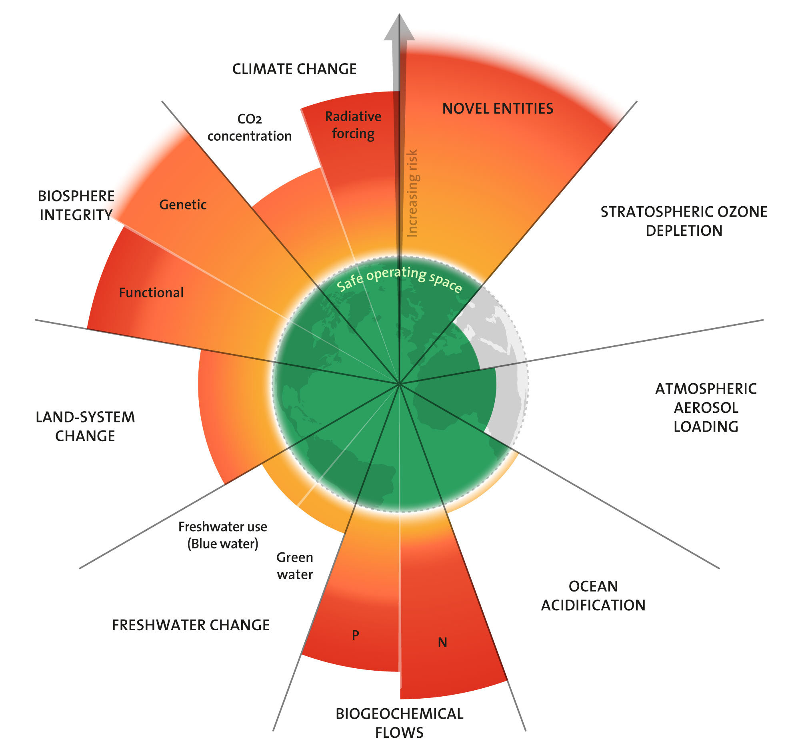

<!-- type: concept -->
# The Need for Change

This section provides background context for the course. It will help you understand the scale and nature of the environmental problem you are advocating around, and give you some of the language and evidence you will need when making the case to others.

!!! tip "Recommended pre-reading"

    Before starting this course, we strongly recommend completing the **[SparkHUB Sustainable Digital Research Awareness (SDRA) training](https://sdratraining.sparkhub.eu/)**. SparkHUB is an open-access platform providing standards, training, and tools for sustainable research practices. The SDRA training will give you a solid grounding in the environmental impacts of digital research — which this course then helps you translate into institutional advocacy.

---

## Planetary Boundaries

In 2009, a team of scientists led by Johan Rockström introduced the concept of **planetary boundaries** — a framework that defines the ecological limits within which human civilisation can safely operate. Think of them as the guardrails of a stable planet.

The framework identifies nine Earth system processes, each with a boundary that, if crossed, risks triggering irreversible and potentially catastrophic change. These include climate change, biodiversity loss, freshwater use, land-system change, and the introduction of novel chemicals and substances.

!!! quote

    "This update on planetary boundaries clearly depicts a patient that is unwell, as pressure on the planet increases and vital boundaries are being breached. We don't know how long we can keep transgressing these key boundaries before combined pressures lead to irreversible change and harm."
    – Johan Rockström, Stockholm Resilience Centre (2023)

The framework has been updated three times — in 2009, 2015, and 2023. The 2023 update was the first time all nine boundaries had been fully quantified. Its conclusion: **six of the nine boundaries have now been crossed**, including climate change, biosphere integrity, land-system change, freshwater change, biogeochemical flows, and novel entities.

This is not only a climate crisis. It is a broader ecological crisis in which human activity is destabilising the systems that make Earth habitable.

!!! tip

    The planetary boundaries diagram is one of the most widely recognised visuals in environmental science. It is a useful reference when making the case for why action matters — most people find it striking. You can download it from the Stockholm Resilience Centre website below.

**Further reading**

- [Stockholm Resilience Centre – Planetary Boundaries](https://www.stockholmresilience.org/research/planetary-boundaries.html) — the home of the framework, with the 2023 update and the downloadable diagram
- [Richardson et al. (2023) – Earth beyond six of nine planetary boundaries](https://doi.org/10.1126/sciadv.adh2458) — the peer-reviewed paper in *Science Advances*

---

## Understanding Emissions

When we talk about the environmental impact of an organisation or activity, emissions are usually measured in **carbon dioxide equivalent (CO₂e)** — a common unit that accounts for different greenhouse gases (carbon dioxide, methane, nitrous oxide, and others) and expresses their combined warming effect as a single number.

Emissions are typically categorised into three scopes:

- **Scope 1** — direct emissions from sources owned or controlled by the organisation (e.g. gas heating, diesel vehicles)
- **Scope 2** — indirect emissions from purchased electricity or heat
- **Scope 3** — all other indirect emissions across the value chain (e.g. supply chains, business travel, purchased goods and services, waste)

Scope 3 is usually the largest category and the hardest to measure. In research institutions it often includes lab consumables, equipment manufacturing, computing infrastructure, and the emissions associated with the research activities of staff and students.

**Embodied emissions** are a subset worth knowing about: the emissions produced in manufacturing, transporting, and disposing of physical goods — a server, a pipette, a building — rather than in using them. A laptop or a piece of lab equipment arrives with a significant carbon cost before it is ever switched on.

!!! tip

    When institutions report only Scope 1 and 2 emissions, they are showing only part of the picture. Advocates for more transparent reporting often focus on pushing for fuller Scope 3 disclosure — and the Concordat's reporting requirements point in this direction.

---

## The Footprint of Research

### Wet labs

A typical life science laboratory has an estimated annual carbon footprint of around 20 tonnes of CO₂e. This is driven by energy-intensive ventilation and refrigeration systems, chemical use, and large volumes of single-use plastic consumables. The [LEAF framework](https://www.ucl.ac.uk/sustainable/leaf/take-part-leaf) (Laboratory Efficiency Assessment Framework), developed by UCL, provides a practical accreditation pathway for labs looking to assess and reduce their environmental impact. It is already in use at a number of UK universities and is worth knowing about if your institution has wet lab facilities.

### Computational research

A common assumption is that computational research is inherently low-impact — that working at a computer is a green alternative to working in a wet lab. This is partly true, but it requires qualification.

!!! quote

    "While the environmental impact of experimental 'wet' labs is more immediately obvious, the impact of algorithms is less clear and often underestimated."
    – Professor Michael Inouye, University of Cambridge

The ICT sector as a whole accounts for an estimated 2–6% of global greenhouse gas emissions — comparable to, or exceeding, aviation. Data centres consume enormous quantities of electricity and water. And as AI and large-scale data science grow, so does the footprint.

Critically, the emissions from computing are not fixed. They depend on the energy source powering the hardware, the efficiency of the code and algorithms being run, whether hardware is shared or left idle, and the embodied emissions of the hardware itself. A poorly optimised analysis run on fossil-fuel-powered infrastructure can generate significant emissions. The same analysis, run efficiently on renewably-powered hardware, may generate a fraction of that.

**The key point for digital researchers is this: computing is not automatically green. But it can be, if we measure and manage it.**

!!! tip

    The [Green Algorithms calculator](http://calculator.green-algorithms.org) allows researchers to estimate the carbon footprint of a specific computational task. It is a practical starting point for anyone who wants to understand the impact of their own work before advocating for wider change.

**Further reading**

- [Green Algorithms Initiative](https://www.green-algorithms.org/) — tools, resources, and a community of practice for sustainable computational science
- [EMBL-EBI – Sustainable Computing in Science](https://www.ebi.ac.uk/training/online/courses/sustainable-computing-in-science/) — a free 3-hour online course introducing the environmental impacts of computational research, last updated January 2026
- [Lannelongue et al. (2021) – Ten simple rules to make your computing more environmentally sustainable](https://www.ncbi.nlm.nih.gov/pmc/articles/PMC8452068/) — a practical starting point, published in *PLOS Computational Biology*
- [Nature Computational Science (2023) – The carbon footprint of computational research](https://www.nature.com/articles/s43588-023-00506-2) — an editorial on the importance of monitoring and reporting
- [Green DiSC – Digital Sustainability Certification](https://www.software.ac.uk/GreenDiSC) — the first open-access certification scheme for research groups, computing teams, and institutions wanting to tackle the environmental impacts of their computing, run by the Software Sustainability Institute. Next application deadline: 15 July 2026
- [LEAF Framework](https://www.ucl.ac.uk/sustainable/leaf/take-part-leaf) — for institutions with wet lab facilities

---

## Why Research Institutions Have a Particular Responsibility

The evidence is clear: human activity is pushing Earth's systems beyond safe limits, and the research sector contributes to this. But research institutions also have particular reasons to act — beyond their own direct footprint.

**Research institutions have influence.** They train the next generation of scientists, shape what gets funded and what gets studied, and are looked to as credible voices on evidence and policy. When they embed environmental sustainability into their own practice, it sends a signal that travels far beyond their own walls.

**The window for action is narrowing.** Emissions reductions made now are more valuable than reductions made later, because greenhouse gases accumulate in the atmosphere over time. Waiting for perfect measurement or perfect policy before acting is not a neutral choice — it is a decision to delay.

**Individual action is not enough — but it is not nothing.** Changes to individual behaviour matter less than systemic change. But systemic change is built from individual advocacy, coalition-building, and persistent pressure on institutions. The two are not in competition. This course is about developing the skills to turn individual concern into systemic impact.

**Further reading**

- [Climate Stripes](https://showyourstripes.info/) — a striking visualisation of warming trends by country and region, by Professor Ed Hawkins
- [IPCC Sixth Assessment Report – Summary for Policymakers](https://www.ipcc.ch/report/ar6/syr/) — the authoritative overview of the current state of climate science
- [Green Algorithms – Community of Practice for Environmentally Sustainable Computational Science](https://forum.escs-community.org/) — an online forum for researchers working on sustainable computing
